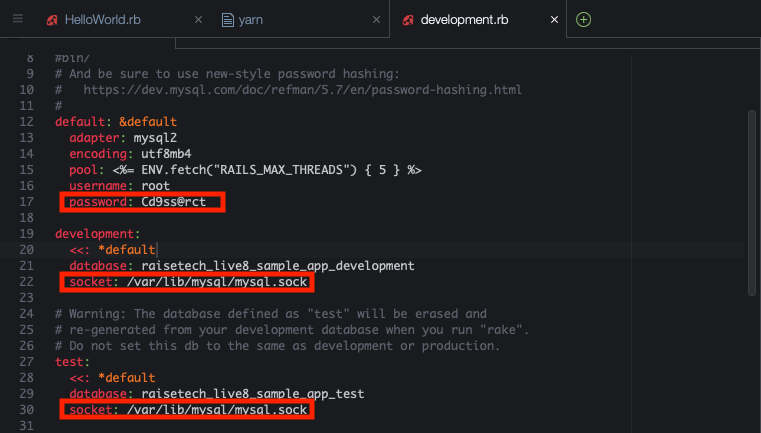
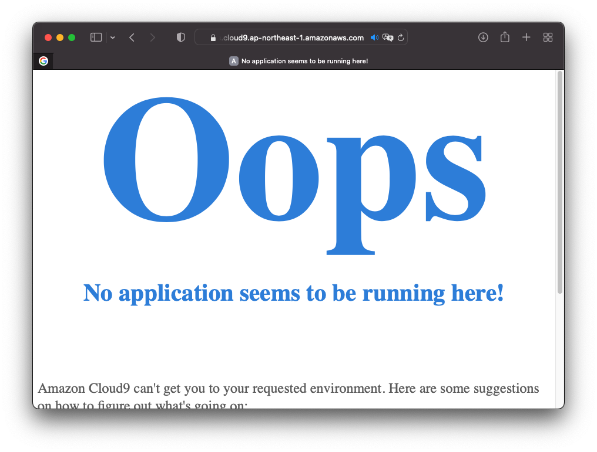

# 第3回課題
<style>
.custom-border {
    border: 1px solid #000;
    padding: 10px;
}
</style>
<div class="custom-border">

## 目次
[1. サンプルアプリケーションの起動](#janp01)

[2. APサーバについて](#janp02)

[3. DBサーバについて](#janp03)

[4. Railsの構成管理ツールについて](#janp04)

[5. 学んだこと](#janp05)

</div>

<div style="height: 40px;"></div>

## <a id="janp01"></a>サンプルアプリケーションの起動
1. アプリケーションクローン
``` ruby
# バージョン確認
git —version
# 以下を貼り付け
git clone https://github.com/yuta-ushijima/raisetech-live8-sample-app.git
```
1. アプリケーションフォルダに移動
``` ruby
cd raisetech-live8-sample-app/
```
1. Ruby Version Managerのアップデート
``` ruby
# 最新のrvmを取得
rvm get master
# 一応バージョンを指定してインストール
rvm install 3.1.2
```
1. MySQLセットアップ
``` ruby
# 不要Dockerイメージを削除して空き確保
docker system prune -a
# AWSアカウントのサービス→EC2→ボリューム→指定のボリュームを選択→変更→サイズを10から16へ
# MySQLインストール
curl -fsSL 
https://raw.githubusercontent.com/MasatoshiMizumoto/raisetech_documents/main/aws/scripts/mysql_amazon_linux_2.sh | sh
```
Active が [active(running)]であることを確認
1. mySQLの初期パスワード設定
``` ruby
# 初期パスワードの確認
sudo cat /var/log/mysqld.log | grep "temporary password" | awk '{print $13}'
# ログイン確認して↑で表示されたパスワードを入力
mysql -u root -p
```
- 初期パスワードのままだと接続できないことがあるようなので…
``` ruby
# YOUR PASSWORDに設定するパスワードを入力
ALTER USER 'root'@'localhost' IDENTIFIED BY ‘YOUR PASSWORD;
FLUSH PRIVILEGES;
```
- icloud9画面左からconfig/development.rbを開いてMySQLのデフォルトパスワードを設定
- socketのパスが違うのでmysql.sockのパスを調べて修正(tmp から var/lib)(2箇所)
- ファイル名を変更して反映
``` ruby
cp config/database.yml.sample config/database.yml
# 念の為確認
mysql -u root -p
```


1. yarn のセットアップ
``` ruby
npm install --global yarn
```
1. 必要なライブラリを自動インストール
``` ruby:setup
bin/setup
```
1. サーバーのマイグレーション
``` ruby
bin/rails db:migrate
```
1. ブロックされないように設定
``` ruby
# 一度アプリケーションを起動
bin/cloud9_dev
```
- 画面上部のPrebiewで表示されたものをコピー
- config/development.rb を開き、最下段に表示されたコードを追加


1. 管理者のみbin/cloud9_devの権限を持たせて実行
``` ruby
sudo chmod 700 bin/cloud9_dev
bin/cloud9_dev
```

<div style="height: 20px;"></div>

## <a id="janp02"></a>APサーバについて
- フロントエンドからのリクエストに対して、DBサーバに動的にリクエストしてレスポンスを返すサーバ
- サーバ名は「puma」、バージョンは5.6.5
- APサーバを終了させた後、ウェブを再読み込みすると以下の表示となり、アクセスすることができなくなる。


``` ruby
# APサーバ起動
bin/cloud9.dev
# 停止はコマンド(CTRL + C)
```

<div style="height: 20px;"></div>

## <a id="janp03"></a>DBサーバについて
- APサーバからのリクエストに応じてDBへの読み書きを行い、必要なデータをAPサーバに返すサーバ
- サーバー名は「MySQL」、バージョンは8.0.33
- APと同じくシステム終了後、再読み込みするとアクセスできなくなる。



``` ruby
# mysql 停止
sudo service mysql stop
# mysql 再起動
sudo service mysql restart
```

<div style="height: 20px;"></div>

## <a id="janp04"></a>Railsの構成管理ツール
- 「bundler」を利用してシステム構成を管理することができる。Ruby環境上で動作するWebアプリケーションフレームワーク
- バージョンは7.0.4

<div style="height: 20px;"></div>

## <a id="janp05"></a>今回学んだこと
- Rubyアプリケーションをクローンし、cloud9上で起動する方法
- アプリケーション作成に必要な環境とプログラムについて、サンプルプログラムの主要ファイルを確認し。どのような処理を行っているのか。
- 大量にコンソールに出力される文字列の必要な箇所をすぐに読み解き、問題が発生したら瞬時に解決できるようにしないといけない点に痛感いたしました。その面でもRaiseTechのサービスはとても有用だとも思いました。

